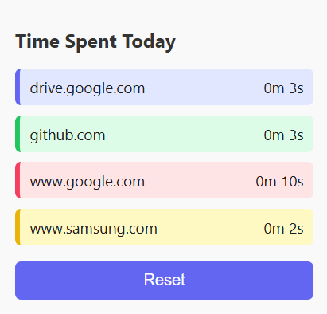

# ⏱️ Chrome Time Tracker Extension

A lightweight Chrome extension to track how much time you spend on each website.

## 📌 Features
- Tracks active time per domain
- Automatically updates time in background
- Clean popup UI with colored domain boxes
- Local storage using `chrome.storage.local`
- Reset time anytime

## 🖼️ UI Preview


## 🛠️ Tech Stack
- JavaScript
- Chrome Extension APIs (Manifest V3)
- HTML/CSS

## 🧪 How to Use (Manual Install)

1. Clone or download this repository
2. Open Chrome and go to `chrome://extensions`
3. Enable **Developer mode** (top right)
4. Click **Load unpacked** and select this folder
5. Open some websites and check the popup to track time

## 📦 Folder Structure

```bash
chrome-time-tracker
├── manifest.json
├── background.js
├── popup.html
├── popup.js
├── styles.css
└── icon.png
```

## 🔒 Permissions
- `tabs`: To detect active website
- `storage`: To store tracked time

## 📃 License
MIT

